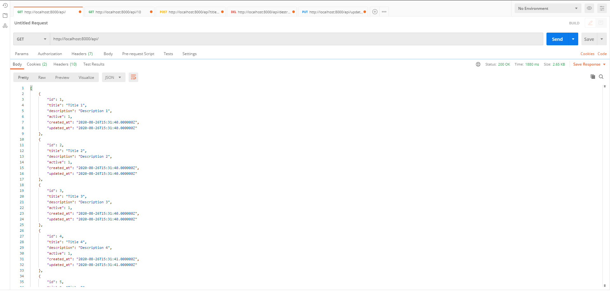
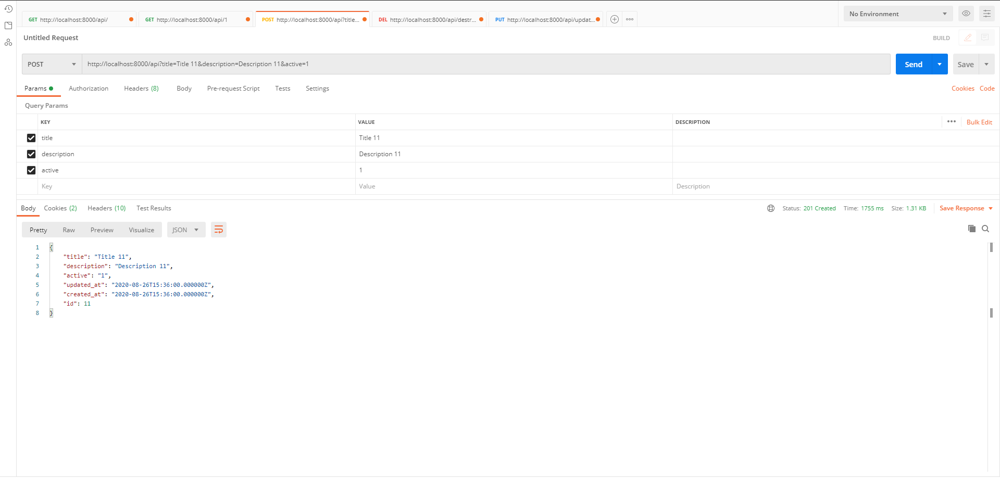
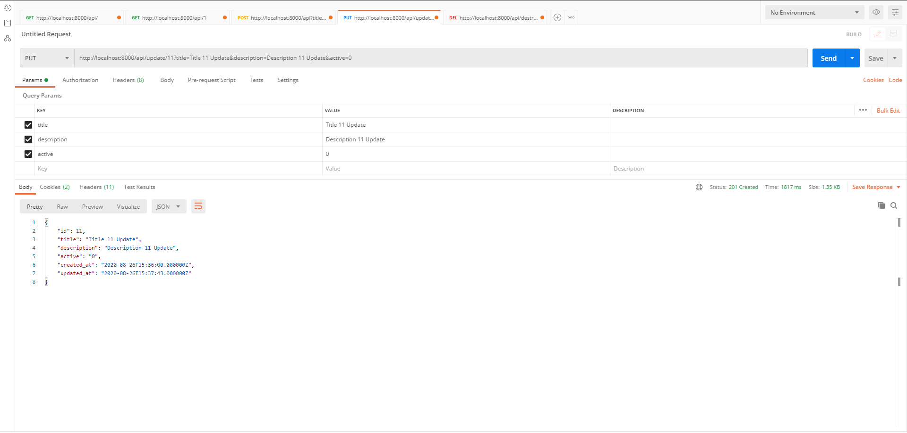
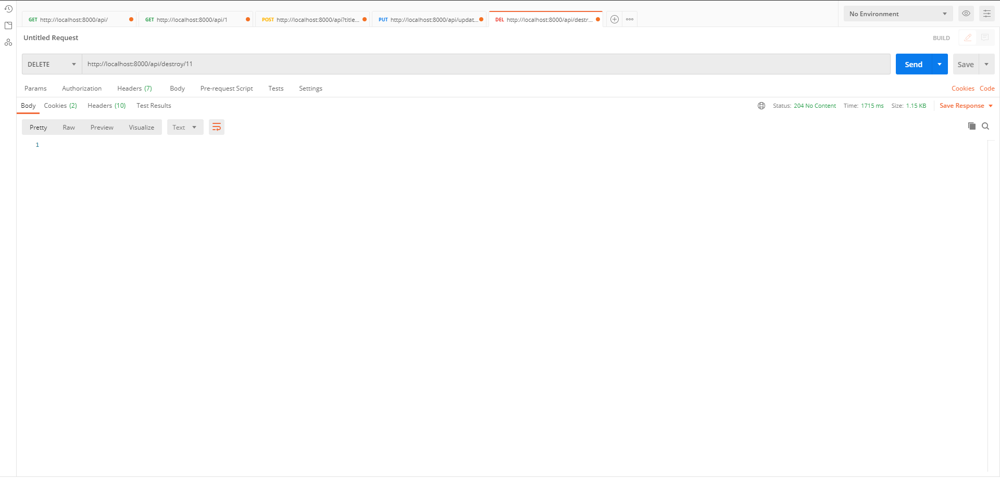

# Laravel API

A simple Laravel API.

## Installation

01. Clone the repository
```
git clone https://github.com/danielgogov-github/Laravel_API.git
```

02. Install all composer packages
```
composer install
```

03. Copy .env
```
cp .env.example .env
```

04. Set database, database username and database password
```
DB_DATABASE=laravel_api
DB_USERNAME=username
DB_PASSWORD=password
```

05. Generate application key
```
php artisan key:generate
```

06. Do migration
```
php artisan migrate
```

07. Fill the table with data
```
php artisan db:seed
```

08. Run the web server
```
php artisan serve
```

## Features

01. Show all products
02. Show a single product
03. Create a new product
04. Edit a product
05. Delete a product

## API Endpoints

Method | Route | Description
--- | --- | ---
`GET` | /api | View all products
`GET` | /api/{id} | View a single product
`POST` | /api | Create a new product
`PUT` | /api/update/{id} | Update a product
`DELETE` | /api/destroy/{id} | Delete a product

## Screenshots 

`View all products`


`View a single product`


`Create a new product`


`Update a product`


`Delete a product`

